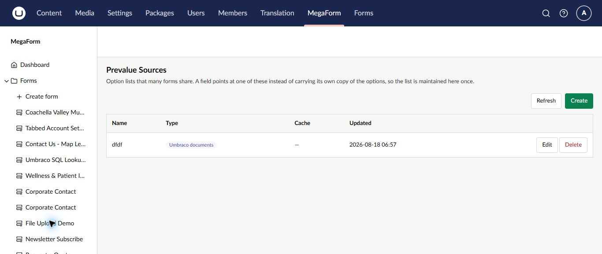
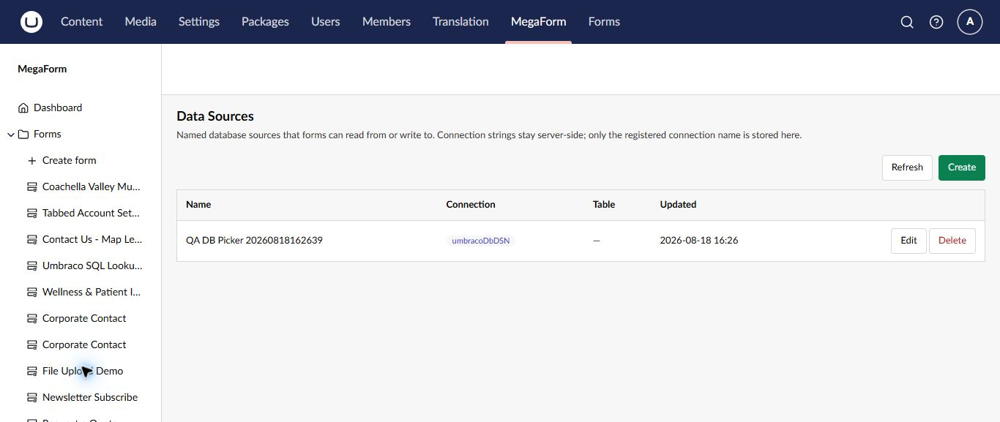

# Reuse option lists and data sources on Umbraco

MegaForm separates reusable choices from database connectivity. **Prevalue Sources** maintain option lists shared by fields, while **Data Sources** register named server-side database sources.

## Prevalue Sources

Use a prevalue source when several forms should share the same countries, departments, products, content items, or other choices.

1. Select **MegaForm → Prevalue Sources**.
2. Select **Create**.
3. Name the source and choose its type.
4. Configure and save the source.
5. Open a choice field in the builder and select the saved source.

Updating the source maintains the list in one place instead of copying options into every form. Test existing forms after a change, particularly when an option value is renamed or removed.

## Data Sources

Data Sources are named database connections that forms and workflows can read from or write to.

1. Select **MegaForm → Data Sources**.
2. Select **Create**.
3. Choose a registered server-side connection and provide a clear reusable name.
4. Select the allowed table or data target when applicable.
5. Save and test the source before using it in a form.

Connection strings stay on the server; MegaForm stores and displays the registered connection name. Keep credentials out of form definitions, field labels, prompts, and documentation.

## Good practice

- Use least-privilege database accounts.
- Prefer read-only access for lookup lists.
- Give every source an owner and purpose.
- Test with non-production data first.
- Review forms before deleting or renaming a shared source.
- Limit write access to the tables and operations the workflow requires.

> [!IMPORTANT]
> A data source can affect multiple forms. Coordinate changes with form owners and verify all dependent forms after editing it.
