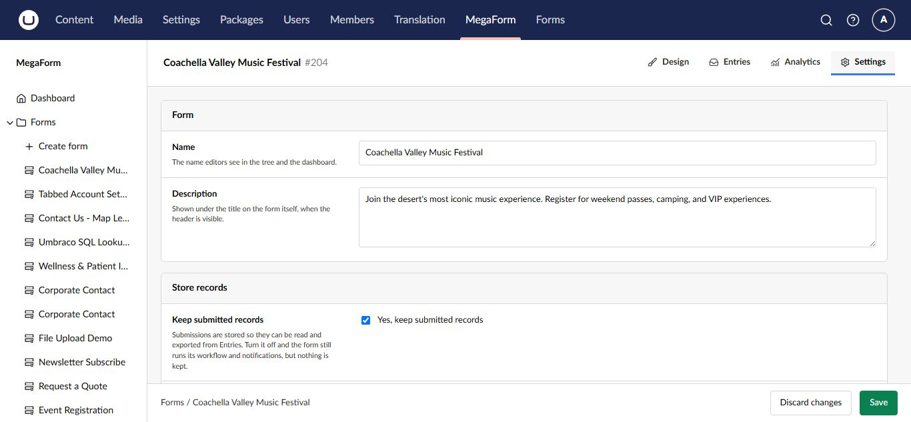

# Use the form builder on Umbraco

The form builder is the main editing workspace. It combines a field palette, visual canvas, form tools, settings, entries, and analytics in one Umbraco workspace.

## Workspace tabs

| Tab | Purpose |
|---|---|
| **Design** | Build pages, sections, layouts, fields, and widgets |
| **Entries** | Review submissions for this form |
| **Analytics** | View form activity and performance |
| **Settings** | Change the form name, description, and storage behavior |

## Add fields and layout

The left palette groups items into **Basic**, **Layout**, and **Widgets**. Drag an item onto the canvas or select an insertion point. Use layout items to group related questions, arrange columns, and divide a long form into pages.

The canvas includes controls to add a page at the beginning or end and to reorder pages. Keep one subject per section and use short, direct labels.

## Configure a field

Select a field on the canvas to open **Field Properties**.

The property panel groups the available settings:

- **General** for label, key, placeholder, help text, and required state.
- **Options** for radio, checkbox, and select choices.
- **Conditional Logic** for showing or enabling the field based on another answer.
- **Security** for field-level access and sensitive data behavior.

Use a stable, meaningful field key before the form receives production submissions. Changing keys later can make old and new entry data harder to compare.

## Form settings

Open the **Settings** workspace tab to update form-level details and choose whether MegaForm stores submitted records.

Turn off **Store records** only when the form's workflow delivers data elsewhere and your retention policy does not require a local entry. Test that external destination before publishing.

## Save, preview, and publish

- **Save draft** keeps the current changes without making them the public version.
- **Preview** shows how the current form behaves before publication.
- **Publish and View Form** publishes the form and opens the public result.

Always test required fields, validation messages, conditional fields, multiple pages, and the success result as a visitor.

## Related guides

- [Ask AI Designer for a form plan](umbraco-ai-designer.md)
- [Configure workflows](umbraco-workflows.md)
- [Review submissions](umbraco-submissions.md)
