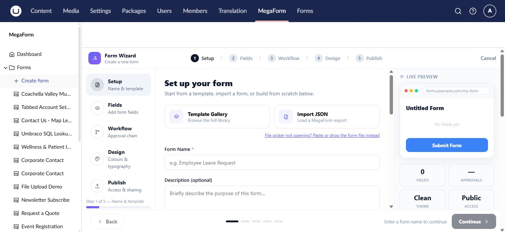

# Use form templates on Umbraco

Templates provide complete starting forms with fields, layout, validation, and design already assembled. They are the fastest choice when an installed template closely matches the job.

## Start from the Template Gallery

1. Select **MegaForm → Create form**.
2. On **Setup**, open **Template Gallery**.
3. Search or browse the available templates.
4. Select a template and review its preview.
5. Change the form name if needed and continue through the wizard.

The template is copied into a new form. Editing the new form does not change the original template.

## Other starting points

- **Quick start** creates a small common field set.
- **Import JSON** restores a MegaForm export from another environment.
- **Create with AI** chooses or adapts a suitable design from a description.
- A blank form starts with no business fields.

## Review a template before use

Check every required field, option value, validation rule, confirmation message, workflow, and integration. Replace sample recipients and URLs, then test on the public Umbraco site.

> [!IMPORTANT]
> Imported or template-provided server scripts are not automatically trusted. A permitted administrator must review and explicitly save them before they can run.

## Choosing between a template and AI

Use a template for a known pattern such as contact, registration, survey, or application. Use AI when the requested form combines several business rules or needs substantial customization. You can start from a template and then refine the result with AI Designer.
