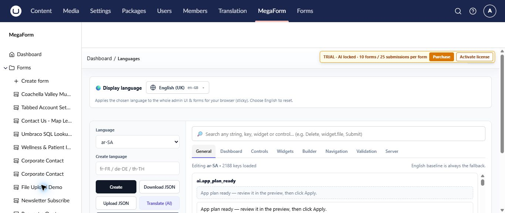
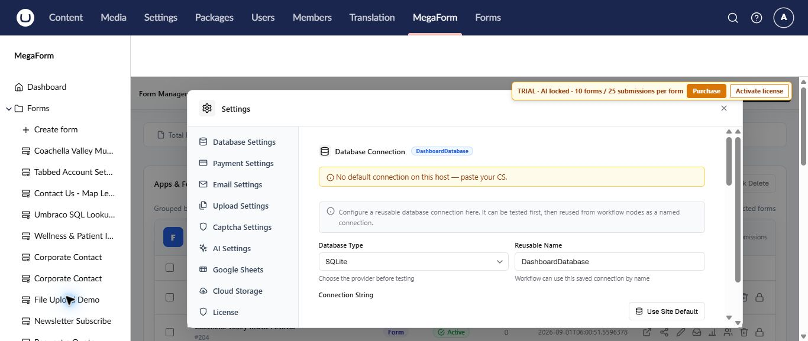

# Languages and global settings on Umbraco

The MegaForm section includes language management for the administration experience and a global settings workspace for services shared by forms.

## Choose and maintain languages

Open **MegaForm → Languages** to select the display language and maintain translated strings.

- **Display language** changes MegaForm administration and form labels for the current browser.
- The language list selects the translation set you want to edit.
- Search finds a string, key, widget, or control.
- **Download JSON** and **Upload JSON** support review and transfer of a translation set.
- **Translate (AI)** can prepare translations when AI is configured; review them before use.

English remains the fallback when a translated value is missing. Test validation, confirmation, and workflow messages as well as visible field labels.

## Configure shared services

Open **MegaForm → Settings** for services used across forms.

| Area | Configure when you need it |
|---|---|
| **Database Settings** | Named database access for lookups or workflows |
| **Payment Settings** | Forms that collect or confirm payments |
| **Email Settings** | Confirmation, notification, or workflow email |
| **Upload Settings** | File upload limits and handling |
| **Captcha Settings** | Automated submission protection |
| **AI Settings** | AI Designer and assisted translation |
| **Google Sheets** | Workflows that send rows to a sheet |
| **Cloud Storage** | External storage for submitted files |
| **License** | Production package activation |

## Change control

Global settings can affect many published forms. Record the previous value, test the new configuration, submit a representative form, and verify the result before considering the change complete. Keep secrets in server-side settings and never place them in form content or screenshots.

## Related guides

- [Design a form with AI](umbraco-ai-designer.md)
- [Reuse option lists and data sources](umbraco-data-sources.md)
- [Manage MegaForm security](umbraco-security.md)
