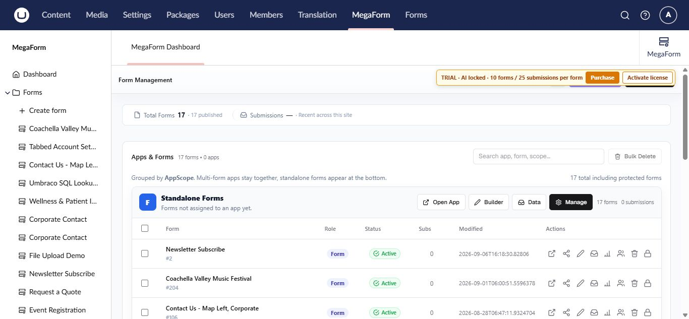

# MegaForm for Umbraco

MegaForm adds a visual form workspace to Umbraco 17. Use it to create forms, publish them, review entries, automate follow-up actions, and manage access without leaving the Umbraco backoffice.

## What you can do

- Build single-page or multi-step forms with drag-and-drop fields, layouts, and widgets.
- Configure validation, conditional logic, field security, themes, and form settings.
- Publish a form at its own public URL or select it on an Umbraco content page.
- Search, filter, and review submitted entries.
- Run simple submission actions or advanced BPMN workflows.
- Reuse option lists and named database sources across forms.
- Translate the MegaForm interface and form labels.
- Ask AI Designer to prepare a form plan that you can review before applying.
- Create a complete new form from a plain-language AI prompt.
- Inspect workflow attempts and retry a failed step from the submission history.
- Optionally run reviewed server-side C# after a saved submission when the scripting add-on is installed.

## The MegaForm section

Sign in to the Umbraco backoffice and select **MegaForm** from the top navigation. The left navigation contains:

| Area | Purpose |
|---|---|
| **Dashboard** | Form totals, recent forms, quick actions, and package status |
| **Forms** | Create a form or open an existing form |
| **Submissions** | Browse entries across forms |
| **Prevalue Sources** | Maintain option lists shared by multiple fields |
| **Data Sources** | Register server-side database connections for form data |
| **Security** | Control what each Umbraco user group may do in MegaForm |
| **Languages** | Select the display language and manage translations |
| **Settings** | Database, payment, email, upload, CAPTCHA, AI, storage, and license settings |

> [!TIP]
> Start with [Install and activate MegaForm](umbraco-installation.md) on a new site. If MegaForm is already installed, go directly to [Create a form](umbraco-create-form.md).

## Typical publishing flow

1. Create a form from a template, imported JSON, quick start, or a blank form.
2. Add and configure fields in the visual builder.
3. Review form settings and any submission workflow.
4. Save a draft, preview it, then publish.
5. Open the public form or select it on an Umbraco content page.
6. Review new entries in **Entries** or **Submissions**.

## Next steps

- [Install and activate MegaForm](umbraco-installation.md)
- [Create a form](umbraco-create-form.md)
- [Create a form with AI](umbraco-create-with-ai.md)
- [Use the form builder](umbraco-form-builder.md)
- [Publish and place a form](umbraco-place-form.md)
- [Configure after-submission behavior](umbraco-after-submission.md)
- [Inspect workflow history and retry](umbraco-workflow-retry.md)
