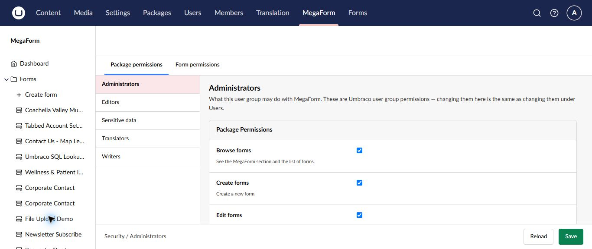

# Manage MegaForm security on Umbraco

MegaForm maps backoffice capabilities to Umbraco user groups. Use **Security** to decide which groups may browse, create, edit, publish, and administer forms or submissions.

## Configure group permissions

1. Select **MegaForm → Security**.
2. Choose an Umbraco user group, such as Administrators, Editors, or Translators.
3. Review **Package permissions** and **Form permissions**.
4. Enable only the capabilities required by that group's job.
5. Select **Save**.

Changing a permission here is the same as changing the corresponding MegaForm permission for that Umbraco user group.

## Suggested separation of duties

| Responsibility | Typical access |
|---|---|
| Form author | Browse, create, and edit assigned forms |
| Publisher | Review and publish approved forms |
| Submission team | Read or process entries for assigned forms |
| Translator | Maintain approved language content |
| Administrator | Configure package settings, data sources, security, and licensing |

Use **Form permissions** when a group should work with some forms but not all forms. Treat sensitive forms separately from ordinary contact or newsletter forms.

## Security checklist

- Follow least privilege and review access regularly.
- Restrict submission data to groups with a clear business need.
- Test permissions with a non-administrator account.
- Remove access when responsibilities change.
- Limit who may edit workflows, data sources, payment settings, and storage settings.
- Avoid collecting sensitive information unless it is necessary and protected by an appropriate retention policy.

> [!IMPORTANT]
> Administrator access can hide permission mistakes during testing. Always verify the intended editor or submission-user experience with an account in the target Umbraco group.
