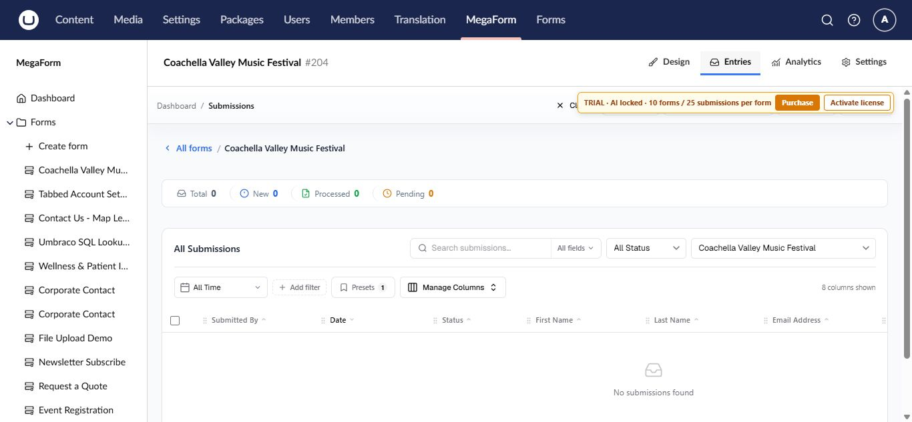

# Review submissions on Umbraco

MegaForm stores each submitted response as an entry when **Store records** is enabled. Open entries from the form workspace or use **MegaForm → Submissions** to work across forms.

## Open a form's entries

1. Select **MegaForm → Forms**.
2. Open the form.
3. Select the **Entries** tab.

The summary shows total entries and date-based counts. The grid provides search, status and date filters, refresh, and column management.

## Find the information you need

- Use **Search** for text in submitted values.
- Filter by **Status** to focus on new, pending, or processed work.
- Set **From** and **To** dates for a reporting period.
- Use **Manage Columns** to show the fields that matter to the current team.
- Open an entry to inspect all answers, uploaded files, and available history.

## Recommended operating routine

1. Decide which statuses represent your team's process.
2. Review new entries on a regular schedule.
3. Move each entry to the correct status after action is taken.
4. Export only the data you need and protect files that contain personal information.
5. Apply a retention policy appropriate for the form's purpose.

> [!IMPORTANT]
> Access to entries is controlled by MegaForm security permissions. Grant submission access only to Umbraco user groups that need it, especially when forms collect sensitive data.

## When the grid is empty

Confirm that the public form is published, submit one test entry, and verify that **Store records** is enabled in the form's Settings tab. A workflow can still deliver data externally when local record storage is disabled, so check the external destination as well.

When an entry contains workflow data, its detail view also exposes the processing history, current task, and retry action for a failed execution. See [Workflow history and retry](umbraco-workflow-retry.md).
