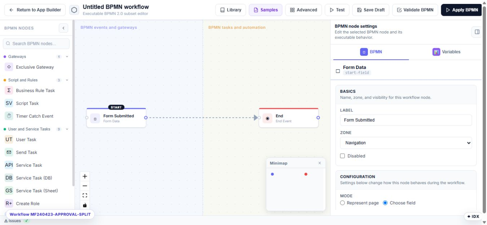

# Reuse workflows from the library on Umbraco

The workflow library turns a proven BPMN process into a reusable, versioned definition. Use it when several forms follow the same approval, notification, or integration process.

## Save the current workflow

1. Open a form's advanced BPMN workflow.
2. Validate and test the diagram.
3. Select **Library**.
4. Save it as a new library workflow with a clear name, category, and description.
5. Create a new version when an existing library process changes.

## Apply a library workflow

1. Open the target form and select **Workflow → Advanced BPMN**.
2. Select **Library**.
3. Choose the workflow and version.
4. Apply it to the form.
5. Test the target form with its own fields, roles, and integrations.

## Version behavior

Pin a form to a tested library version when production behavior must remain stable. A newer library version does not silently replace a pinned definition. Reapply the newer version after reviewing its field mappings, role names, credentials, and side effects.

Use automatic updates only when the organization accepts changes flowing to every bound form. Unbind a form when it must maintain its own independent workflow.

## Safe reuse checklist

- Required field keys exist on the target form.
- Candidate roles and users exist in the target Umbraco environment.
- Named email, database, sheet, and storage settings exist.
- URLs and recipients are appropriate for the environment.
- Both approved and rejected branches have been tested.
- A rollback version remains available.
