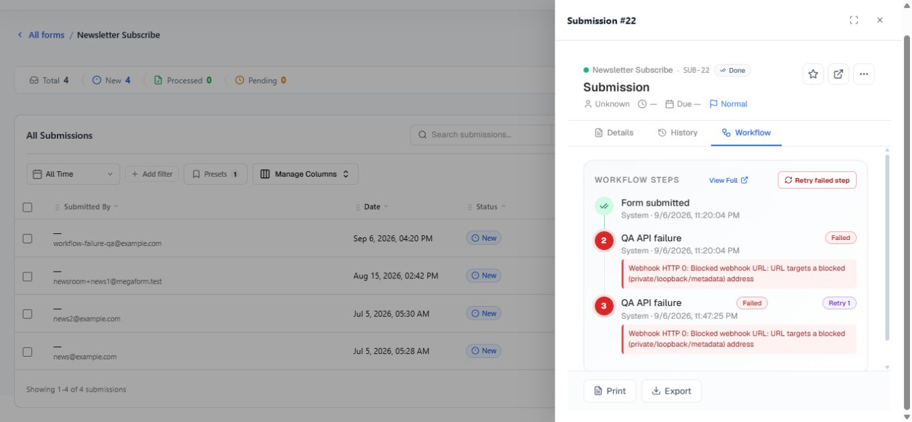

# Inspect workflow history and retry a failed step on Umbraco

MegaForm records workflow attempts with their node, status, duration, and error. When a workflow execution fails, an administrator can retry from the failed current node instead of starting the complete submission process again.

## Find the failure

1. Open **MegaForm → Submissions**.
2. Open the affected entry.
3. Select its **History** or **Workflow** view.
4. Find the failed node and read the recorded error.

The workflow view can show the active node, successful attempts, failed attempts, retry count, duration, open tasks, and per-step history. A retry action is shown only when the execution is failed and has a retryable current node.

The screenshot below is from the real Umbraco submission panel. It shows a successful **Form submitted** step, two failed attempts of **QA API failure**, the **Retry 1** badge, the recorded webhook error, and the **Retry failed step** action.

## Fix the cause first

Before retrying, correct the condition that caused the failure. Examples include an unavailable endpoint, rejected credentials, invalid email settings, a missing named database connection, or an invalid destination record.

If the BPMN definition itself is wrong, edit it, validate it, and apply the corrected definition. The failed node ID must still exist in the applied workflow or the retry cannot continue.

## Retry the step

Select **Retry step** in the submission workflow panel, or **Retry failed step** when it appears in the task workflow view.

Only Umbraco administrators can retry a workflow execution. MegaForm refuses a retry when the execution is not failed, no applied workflow exists, or the saved current node cannot be found.

## What retry does

- It resumes at the failed current node.
- Previously completed nodes are not intentionally replayed.
- The same execution ID is retained and the new attempt is added to history.
- The error is cleared while the retry runs, then updated if the step fails again.
- Concurrent retry clicks for the same execution are serialized on the current host.

> [!IMPORTANT]
> The failed node may perform an external side effect. Confirm whether the first attempt partially succeeded before retrying a payment, email, database write, or API call. Design external operations to be idempotent whenever possible.

## Automatic retry inside a webhook node

A webhook service task also has its own **Retry attempts**, **Delay seconds**, and **Backoff** settings. Those retries occur inside that node during one workflow attempt. Manual **Retry step** is different: it starts a new attempt after the workflow has reached the failed state.

Use short automatic retries for temporary HTTP failures. Use manual retry when an administrator must correct credentials, data, or an external service first.

## Verify the result

Refresh the submission detail and confirm the new attempt, final status, and downstream side effects. If it fails again, use the newest error rather than repeatedly clicking retry.
