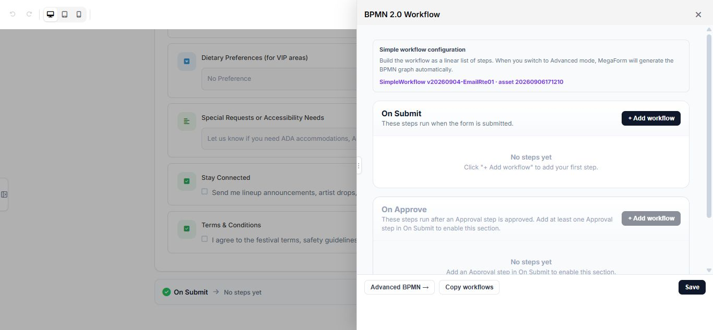

# Configure workflows on Umbraco

Workflows decide what MegaForm does after an event such as a new submission. Start with the simple workflow for common actions, then move to Advanced BPMN when the process needs branches, approvals, retries, or several connected steps.

## Open the workflow editor

1. Open a form in **MegaForm → Forms**.
2. Select **Workflow** in the builder toolbar.
3. Review the simple workflow or select **Advanced BPMN**.

## Simple workflow

The simple editor groups actions by event. Common events include:

- **On Submit** for confirmation email, notification, data delivery, or follow-up processing.
- **On Approve** for actions that run after an approval is accepted.

Add only the actions needed by the form. Configure email, database, payment, storage, or other site-wide services before selecting workflow actions that depend on them.

The simple editor includes common communication, action, integration, and logic steps:

| Step | Typical use |
|---|---|
| **Show message / Redirect** | Control the visitor result after submit |
| **Send email** | Confirm receipt or notify a team |
| **Approval** | Pause and wait for a reviewer |
| **Push to API** | Send data to an HTTP endpoint |
| **Insert into database** | Write to a named connection or procedure |
| **Google Sheets** | Append a row to a sheet |
| **Wait** | Resume after a duration or date |
| **Set variable / Calculate** | Prepare values for later steps |

## Advanced BPMN

Use Advanced BPMN for a business process that contains conditions, human decisions, parallel work, delays, or integrations. Give nodes descriptive names so another administrator can understand the process without opening every setting.

The toolbar separates workflow lifecycle states:

- **Save Draft** stores the diagram without changing the process currently used by published submissions.
- **Validate BPMN** checks the executable graph and reports missing or invalid configuration.
- **Test** runs the draft against sample data.
- **Apply BPMN** makes the validated workflow the active definition for this form.

The palette provides gateways, business rules, workflow variables, timers, user tasks, email tasks, API service tasks, database tasks, Google Sheets tasks, identity actions, and end events. A **Script Task** sets a workflow variable; it is not the same as the optional C# after-submission server script.

## Reuse a workflow

Select **Library** in the BPMN toolbar to save a diagram as a reusable workflow or apply a saved workflow to another form. Applied library versions can be pinned so a production form does not change when a newer library version is created.

## Test safely

1. Save the workflow and form as a draft.
2. Submit test data with a clearly recognizable email address or reference.
3. Verify the entry status and every external result.
4. Test each conditional branch and both approval outcomes.
5. Publish only after all expected actions complete once.

> [!TIP]
> Build the workflow in small stages. A submit event followed by one action is much easier to verify than a complete business process added all at once.

## Troubleshooting

If an action does not run, verify that it is connected to the correct event, its required site-wide setting is complete, and the form version containing the workflow is published. Review the entry and available workflow history to identify the failed step before retrying.

## Related guides

- [Approval workflows](umbraco-workflow-approvals.md)
- [Workflow history and retry](umbraco-workflow-retry.md)
- [Workflow library](umbraco-workflow-library.md)
- [After-submission settings](umbraco-after-submission.md)
